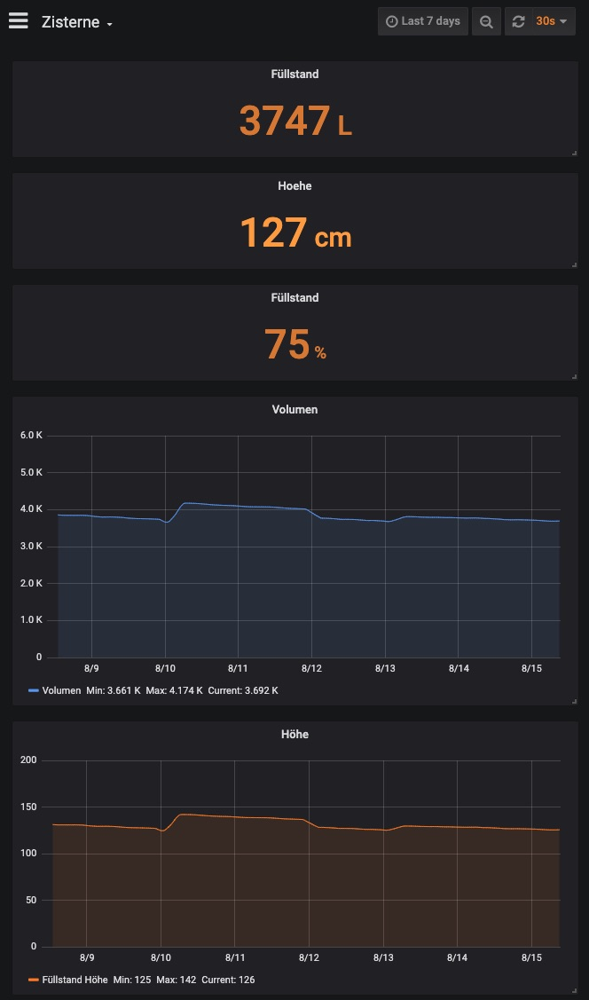
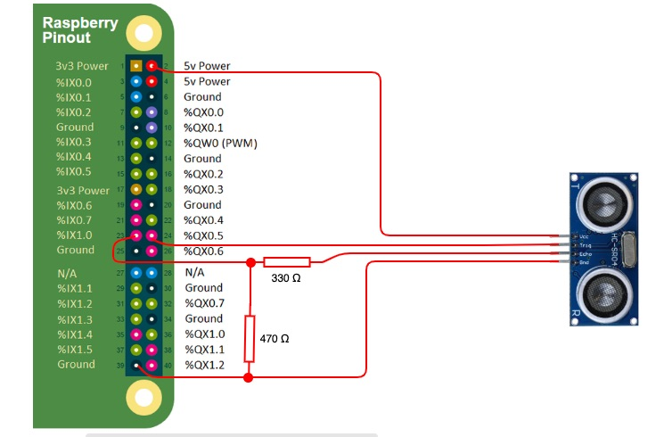

# Measure fill-level of oil tank / water-cistern with Raspberry Pi and Ultrasonic Sensor HC-SR04

Python program to measure fill-level with Raspberry Pi and Ultrasonic Sensor HC-SR04, log data into InfluxDB and generate a nice looking Dashboard in Grafana for visualization.

## Grafana Dashboard
Fill-level are displayed via a Grafana Dashboard, Grafana is pulling the information from Influx-DB.

## Hardware required
* Raspberry Pi (Zero works as well)
* HC-SR-04

## Wiring
Following picture shows the circuit how to connect Pi with HC-SR04 ultrasonic sensor. 

You need the resistors (voltage divider) in order to drop the voltage going to the GPIO pins down to 3.3v from 5v. 

