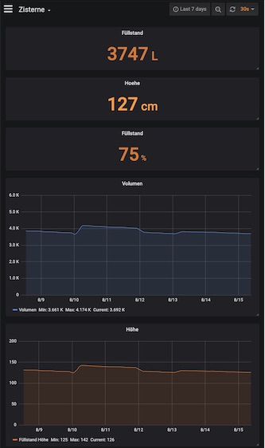

# Measure fill-level of oil tank / water-cistern with Raspberry Pi and Ultrasonic Sensor HC-SR04

Measure fill-level with Raspberry Pi and Ultrasonic Sensor HC-SR04, log data into InfluxDB.
Fill-level and historic trend data are displayed via a Grafana Dashboard, Grafana pulling the information from InfluxDB.

## Hardware required
* Raspberry Pi (Pi Zero works as well)
* HC-SR-04 Ultrasonic Module
* Waterproof case for HC-SR-04
* Cable to connect HC-SR04 and RPi (4-wire)

## Wiring
Following picture shows the circuit how to connect Pi with HC-SR04 ultrasonic sensor. 

You need the resistors (voltage divider) in order to drop the voltage going to the GPIO pins down to 3.3v from 5v. 

## Software components needed
* Python
* InfluxDB
* Grafana

## Configuration
(1) Setup Influx by running the DB Setup scripts

(2) Adjust Parameters in the phyton code to your local config (InfluxDB) and tank (volume, height)

(3) Run the Phyton script and check the output

(4) Setup Grafana - InfluxDB Connection

(5) Setup Grafana Dashboard

